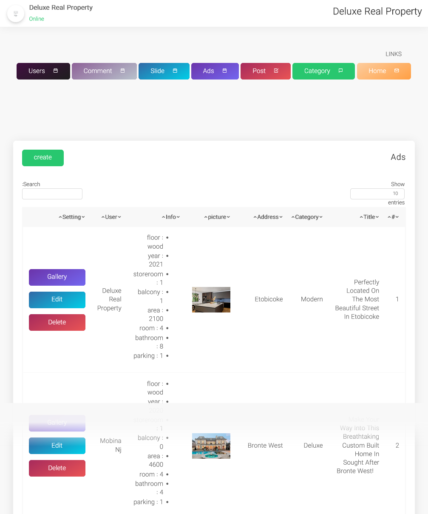
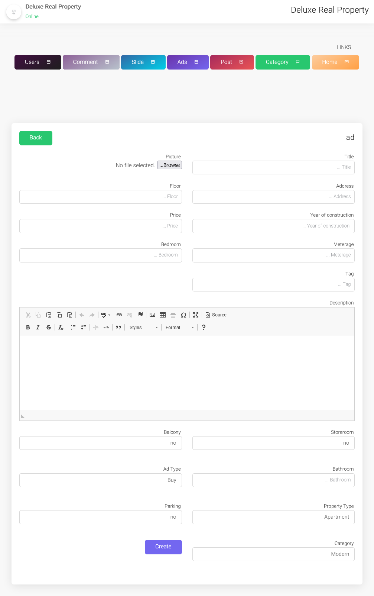

# Deluxe Real Property

An Open Source Real estate management system written with php mvc.

## Table of Contents
* [General Info](#general-information)
* [Technologies Used](#technologies-used)
* [Features](#features)
* [Screenshots](#screenshots)
* [Setup](#setup)
* [Usage](#usage)
* [Project Status](#project-status)
* [Contact](#contact)
<!-- * [License](#license) -->

## General Information

This is an Open Source Real estate management system written with php mvc that helps agents to manage rentals and properties. 
In this project, you can post an article about the property. and manage article comments.

## Technologies Used
- PHP 7.4.32
- Composer 2.4.3

## Features
List the ready features here:
- Advertising Page
- Blog Page
- Details Ad Page
- Best Ads
- Admin Panel
- Ads Gallery
- Slideshow
- Categories Management 

## Screenshots

## Setup
1. Install XAMPP or WAMPP

2. Open XAMPP Control panal and start [apache] and [mysql] .

3. Download project from github(https://github.com/MobinaJafarian/DeluxeRealProperty)  
    OR follow gitbash commands
    
    i>cd C:\\xampp\htdocs\
    
    ii>git clone https://github.com/MobinaJafarian/DeluxeRealProperty.git
    
4. extract files in C:\\xampp\htdocs\.

5. open link localhost/phpmyadmin

6. click on new at side navbar.

7. give a database name as (new-mvc) hit on create button.

8. after creating database name click on import.

9. browse the file in directory
[project/database/new-mvc.sql].

10. after importing successfully.

11. in terminal type `php -S localhost:8000 -t public` .

12. open any browser and type http://localhost:8000/

13. first register and then login

14. admin login details: 
- Email = admin@gmail.com 
- Password = 123456789

## Usage

`php -S localhost:8000 -t public`

## Project Status
Project is: _complete_

## Contact
Created by [@MobinaJafarian](https://github.com/MobinaJafarian) - feel free to contact me!

<!-- Optional -->
<!-- ## License -->
<!-- This project is open source and available under the [... License](). -->
